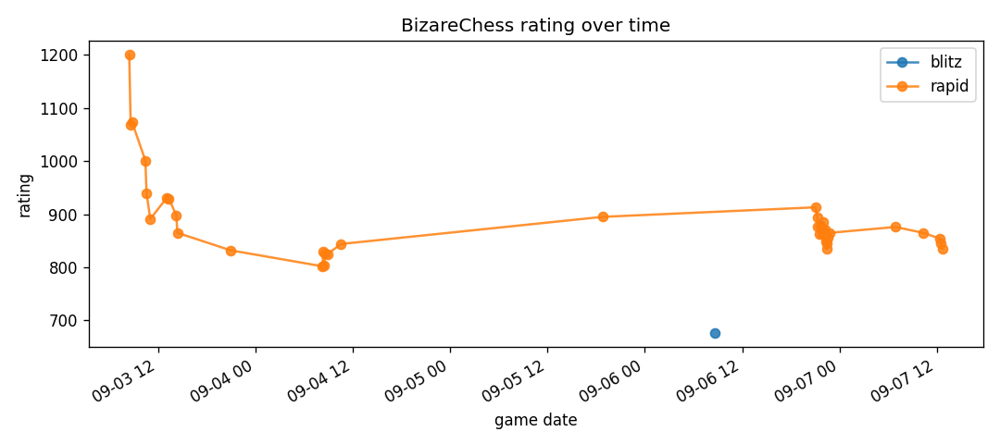
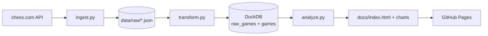

# chess-analytics

*A tiny ELT pipeline that pulls my chess.com games, loads them into DuckDB, and publishes a dashboard.*

[](https://sammybolger.github.io/chess-analytics/)
[](LICENSE)

I wanted a repeatable way to look at my openings and results without clicking through chess.com. This project pulls every game I've played, loads it into DuckDB, and writes an HTML dashboard that GitHub Pages serves.

**Live report:** https://sammybolger.github.io/chess-analytics/

## Overview

An end-to-end ELT job in three scripts. Ingest hits the chess.com public API, transform parses PGNs into a clean typed table, and analyze runs the queries and writes the report.

## Features

- Pulls every monthly archive for a chess.com username with no auth needed
- Parses PGN with `python-chess` to extract opening, termination, and move count
- Keeps a `raw_games` table alongside the flat `games` table so the transform step is idempotent
- Generates a static HTML dashboard for GitHub Pages

## Demo



Live at https://sammybolger.github.io/chess-analytics/

## Tech Stack

- **Python 3.11** — one runtime for all three steps
- **DuckDB** — single-file columnar store, no server. Fits a personal dataset without any Postgres overhead
- **python-chess** — parses PGN reliably. Move count and termination live inside the PGN body, not the JSON metadata
- **matplotlib** — static chart rendering. PNGs go straight into `docs/` for GitHub Pages
- **requests** — chess.com public API client, one endpoint per month

## Architecture



Ingest saves each month as a JSON file so transform can be re-run without hitting the API. Transform builds two tables: `raw_games` keeps the original JSON per game, `games` is the flat, typed table analysis reads from. Analyze runs the queries, saves chart PNGs, and writes `docs/index.html`.

## Project Structure

```
chess-analytics/
├── ingest.py          # fetch monthly archives from chess.com
├── transform.py       # parse PGN, load DuckDB (raw + flat)
├── analyze.py         # queries, charts, HTML report
├── requirements.txt
├── data/              # raw JSON + DuckDB file (gitignored)
└── docs/              # HTML report + charts (served by GH Pages)
```

## Installation & Setup

**Prerequisites**
- Python 3.11+

**Local setup**
```bash
git clone https://github.com/SammyBolger/chess-analytics.git
cd chess-analytics
pip install -r requirements.txt

python ingest.py       # writes data/raw/*.json
python transform.py    # writes data/chess.duckdb
python analyze.py      # writes docs/index.html and PNGs
```

Change the `USERNAME` constant at the top of `ingest.py`, `transform.py`, and `analyze.py` to point at a different chess.com account.

## Usage

Open `docs/index.html` in a browser, or view the hosted version at https://sammybolger.github.io/chess-analytics/.

Ad-hoc SQL against the DuckDB file:
```bash
python -c "import duckdb; print(duckdb.connect('data/chess.duckdb', read_only=True).execute('SELECT opening_name, COUNT(*) FROM games GROUP BY 1 ORDER BY 2 DESC LIMIT 5').df())"
```

## Engineering Decisions

**Raw + flat split.** I keep the original chess.com JSON in `raw_games` alongside the flat `games` table. If I want to extract a new column later (say, opening move sequence) I re-run `transform.py` without hitting the API again. This is the standard bronze/silver idea, scaled down to a personal project.

**DuckDB over SQLite or Postgres.** SQLite would work but DuckDB's columnar engine is faster for the aggregate queries I actually run, and it still ships as a single file with no server. Postgres would be overkill for one player's game history.

**Static HTML report over Streamlit.** GitHub Pages is free, has zero cold start, and the data only changes when I run the pipeline. A Streamlit app would need a hosted runtime for something the reader can already get from a static page.

**python-chess for PGN parsing.** Regex over PGN is a rabbit hole. python-chess is the canonical library and handles the edge cases (comments, variations, glyphs) I do not want to think about.

## Limitations & Future Improvements

- Only one player is analyzed. The three scripts share a `USERNAME` constant instead of a config file
- No scheduled refresh yet. Running as a nightly GitHub Action would keep the dashboard current
- Opening groupings are noisy. "Four Knights Game" and "Four Knights Game Italian Variation" show up separately. Rolling up by ECO code prefix would help
- Rating trend chart lumps all time controls together on one axis. Splitting by time class (rapid, blitz, bullet) would be a truer signal

## License

[MIT](LICENSE)
