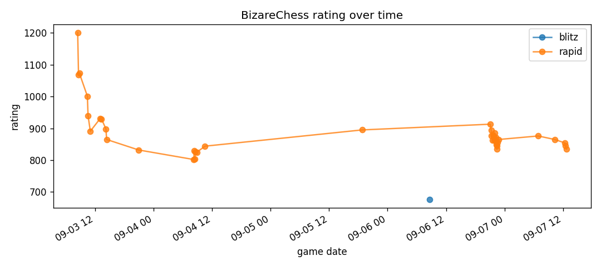
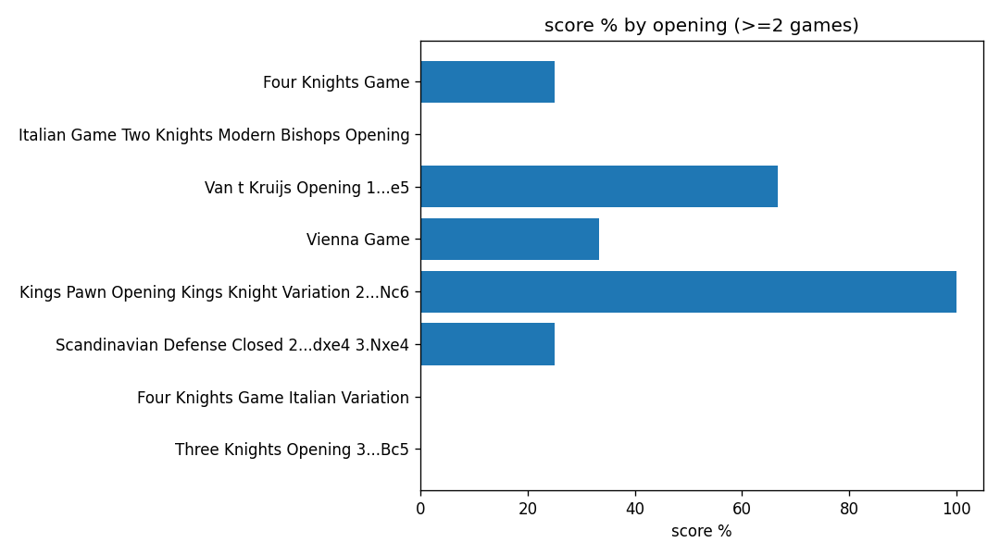

# chess-analytics

A small end-to-end data pipeline over my own chess.com game history.

I made this because I wanted a repeatable way to look at my openings and
results without clicking through the site. It pulls every game I've played,
loads it into DuckDB, and generates a few charts.

## What it does

```
chess.com API   ->   raw JSON files   ->   DuckDB (raw + flat tables)   ->   charts
   ingest.py           data/raw/                data/chess.duckdb            charts/
```

1. `ingest.py` hits the public chess.com API and saves each monthly archive
   as a JSON file. No auth needed. Rate limited politely.
2. `transform.py` parses each PGN with `python-chess`, extracts the fields I
   actually care about (color, result, opening, rating, accuracies, move
   count) and loads two DuckDB tables:
   - `raw_games` keeps the original JSON payload per game so I can go back
     for a field I forgot
   - `games` is the flat, typed table for analysis
3. `analyze.py` runs the queries and drops PNG charts into `charts/`.

## Setup

```bash
pip install -r requirements.txt
python ingest.py
python transform.py
python analyze.py
```

The database file (`data/chess.duckdb`) and raw JSON are gitignored so the
repo stays small. Running the three scripts in order rebuilds everything.

## What I look at

- overall record and score percentage
- score % by color (white vs black)
- most-played openings and how I do in each
- rating trend across time controls




## Notes on the design

- **Raw + flat split.** Keeping the raw JSON as its own table means the
  transform step is idempotent. If I add a new column later I re-run
  `transform.py` and don't have to re-fetch from the API.
- **DuckDB over Postgres.** This is a personal dataset with 39 games and
  growing. DuckDB gives me a single file, columnar performance, and no
  server to manage.
- **PGN parsing with python-chess.** The chess.com API only gives ECO in a
  URL. Move count and termination are inside the PGN, and python-chess is
  the standard library for reading it.

## What I'd add next

- a scheduled GitHub Action to re-ingest weekly
- accuracy vs opponent rating scatter (need more games first)
- expected score based on rating gap, so I can see over/underperformance
