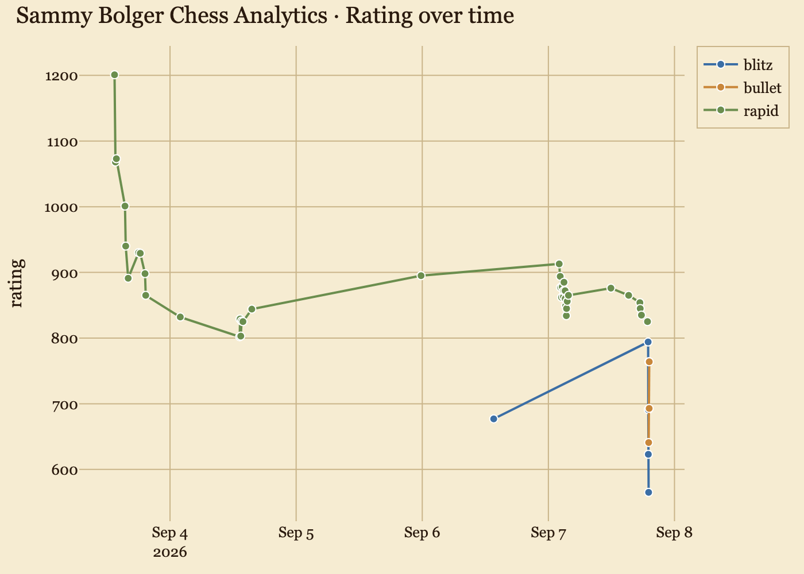
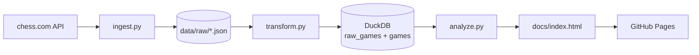

# chess-analytics

*A small ELT pipeline that pulls my chess.com games, loads them into DuckDB, and publishes an interactive dashboard.*

[](https://sammybolger.github.io/chess-analytics/)
[](LICENSE)

I wanted a repeatable way to look at my openings and results without clicking through chess.com. This project pulls every game I've played, loads it into DuckDB, and writes an interactive HTML dashboard that GitHub Pages serves. A GitHub Action re-runs the pipeline daily so the dashboard stays current.

**Live Dashboard:** https://sammybolger.github.io/chess-analytics/

## Overview

An end-to-end ELT job in three scripts. Ingest hits the chess.com public API, transform parses PGNs into a clean typed table, and analyze runs the queries and writes the report.

## Features

- Pulls every monthly archive for a chess.com username with no auth needed
- Parses PGN with `python-chess` to extract opening, termination, and move count
- Keeps a `raw_games` table alongside the flat `games` table so the transform step is idempotent
- Interactive Plotly dashboard: rating trend, rolling form, day/hour activity heatmap, game length by outcome, opening performance, Elo-expected vs actual score, head-to-head, recent games
- Auto-refreshed daily via GitHub Actions, and manually re-runnable from the Actions tab

## Demo

[](https://sammybolger.github.io/chess-analytics/)

Every chart on the live site supports hover tooltips, drag-to-zoom, and double-click to reset. The colored dots on the by-time-control table map each series in the rating chart to its color.

## Tech Stack

- **Python 3.11** — one runtime for all three steps
- **DuckDB** — single-file columnar store, no server. Fits a personal dataset without any Postgres overhead
- **python-chess** — parses PGN reliably. Move count and termination live inside the PGN body, not the JSON metadata
- **Plotly** — every chart is an interactive Plotly div inlined into `docs/index.html`. Hover tooltips, zoom, pan. Plotly.js loads once from CDN
- **requests** — chess.com public API client, one endpoint per month
- **GitHub Actions** — daily cron reruns the pipeline and commits `docs/` back to main

## Architecture



Ingest saves each month as a JSON file so transform can be re-run without hitting the API. Transform builds two tables: `raw_games` keeps the original JSON per game, `games` is the flat, typed table analysis reads from. Analyze runs the queries, builds Plotly figures, and inlines them into a single `docs/index.html`.

## Project Structure

```
chess-analytics/
├── ingest.py               # fetch monthly archives from chess.com
├── transform.py            # parse PGN, load DuckDB (raw + flat)
├── analyze.py              # queries, Plotly figures, HTML report
├── requirements.txt
├── .github/workflows/
│   └── refresh.yml         # daily cron that reruns the pipeline
├── data/                   # raw JSON + DuckDB file (gitignored)
└── docs/                   # index.html served by GitHub Pages
```

## Installation & Setup

**Prerequisites**
- Python 3.11+

**Local setup**
```bash
git clone https://github.com/SammyBolger/chess-analytics.git
cd chess-analytics
pip install -r requirements.txt

python ingest.py       # writes data/raw/*.json
python transform.py    # writes data/chess.duckdb
python analyze.py      # writes docs/index.html
```

Change the `USERNAME` constant at the top of `ingest.py`, `transform.py`, and `analyze.py` to point at a different chess.com account.

## License

[MIT](LICENSE)
